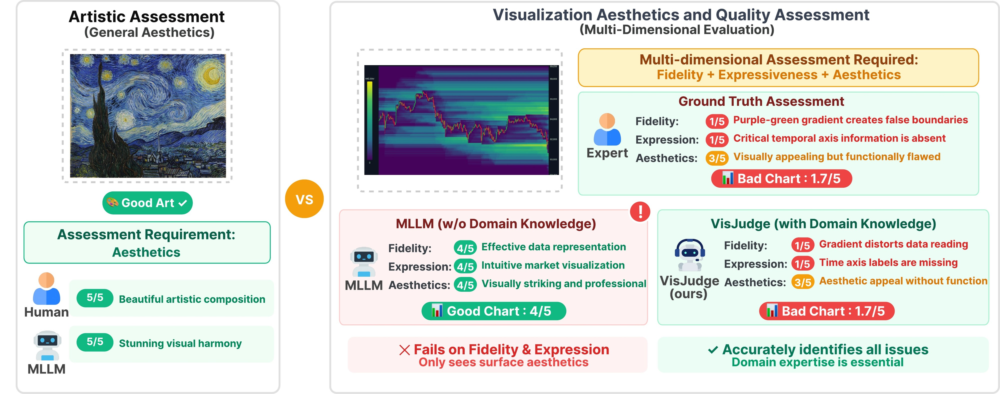
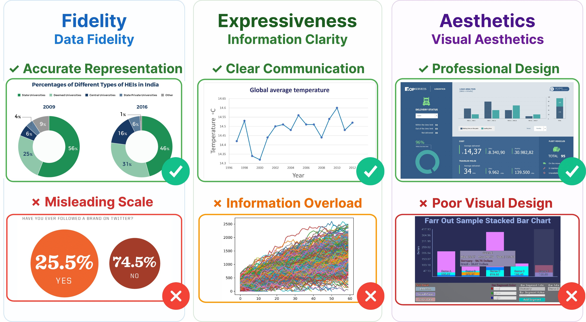
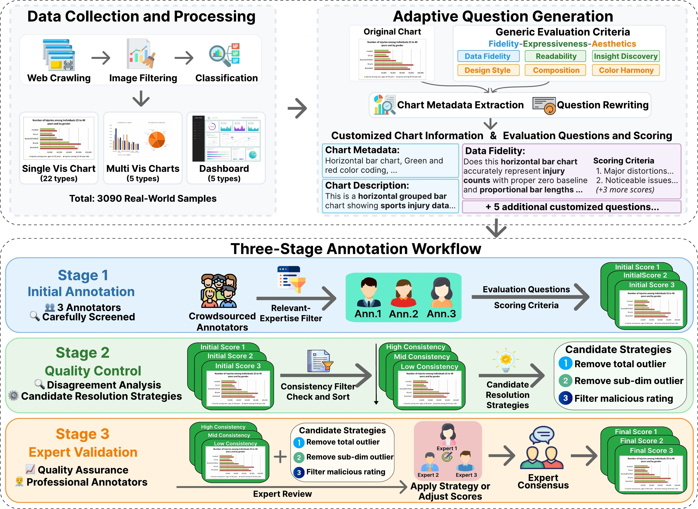
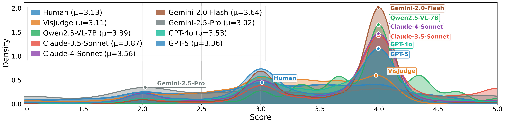
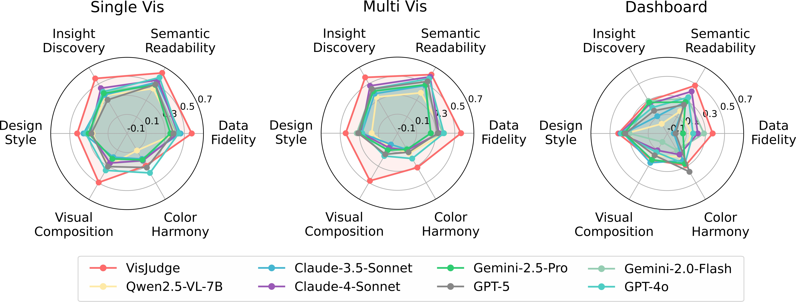
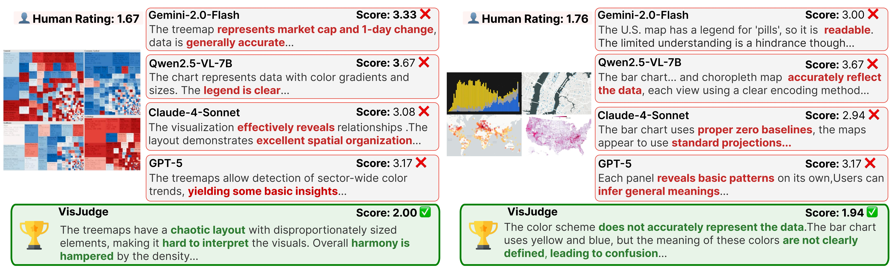
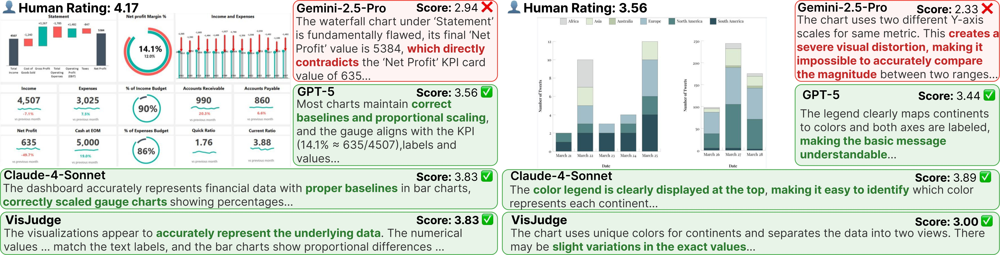

# 📊 VisJudgeBench

**VisJudgeBench: Aesthetics and Quality Assessment of Visualizations**

[](https://arxiv.org/abs/2510.22373)
[](https://huggingface.co/xypkent/visjudge-7b)

## 📰 News

- **[2026-02]** 🎉 Our paper has been **accepted to ICLR 2026**!
- **[2025-10]** 🤖 **VisJudge-7B** model released on [HuggingFace](https://huggingface.co/xypkent/visjudge-7b)
- **[2025-10]** 📊 **VisJudgeBench** dataset released with 3,090 expert-annotated samples

## 📋 Project Roadmap

- [x] Release VisJudgeBench dataset (3,090 samples)
- [x] Release VisJudge-7B model on HuggingFace
- [ ] Release raw evaluation scores
- [ ] Launch demo website

## 🎯 About VisJudgeBench

VisJudgeBench is a comprehensive benchmark for evaluating MLLM visualization aesthetics and quality. It contains **3,090 expert-annotated samples from real-world scenarios**, covering single visualizations, multiple visualizations, and dashboards across **32 chart types**. Each sample includes visualization images, six-dimensional quality scores based on the **Fidelity-Expressiveness-Aesthetics** evaluation framework, and evaluation prompts.

<div align="center">
  
  <p><em>Why we need specialized visualization assessment: MLLMs excel at general aesthetics but struggle with visualization-specific evaluation</em></p>
</div>

## 🔍 Evaluation Framework

Our benchmark evaluates visualizations across three fundamental dimensions, operationalized into six measurable metrics:

<div align="center">
  
  <p><em>The Fidelity-Expressiveness-Aesthetics evaluation framework with positive and negative examples</em></p>
</div>

**1. Fidelity - Data Accuracy and Truthfulness**

- `data_fidelity`: Evaluates whether visual encodings accurately reflect the original data, avoiding misleading interpretations caused by improper axis settings, scale distortions, or other design flaws.

**2. Expressiveness - Information Clarity and Understandability**

- `semantic_readability`: Assesses the clarity of basic information encoding and whether users can unambiguously decode visual elements.
- `insight_discovery`: Evaluates the effectiveness in revealing deep data patterns, trends, or outliers, helping users transition from "reading information" to "gaining insights".

**3. Aesthetics - Visual Aesthetics and Refinement**

- `design_style`: Measures the innovation and uniqueness of design, including novel visual elements and distinctive style.
- `visual_composition`: Focuses on the rationality of spatial layout, evaluating the balance and order of element positioning, size proportions, and spacing arrangements.
- `color_harmony`: Assesses the coordination and functionality of color combinations, ensuring color palette choices balance aesthetics with effective information communication.

## 🏗️ Benchmark Construction

Our benchmark follows a rigorous three-stage construction pipeline to ensure high-quality annotations:

<div align="center">
  
  <p><em>Three-stage benchmark construction: Data Collection → Evaluation Framework → Expert Annotation</em></p>
</div>

## 📁 Repository Structure

```
VisJudgeBench/
├── README.md                    # This file
├── VisJudgeBench.json          # Complete dataset with 3,090 annotated samples
├── figures/                    # Figures for documentation
└── images/                     # Visualization images organized by category
    ├── single_vis/             # Single visualization charts
    ├── multi_vis/              # Multi-panel visualizations
    └── dashboard/              # Dashboard-style visualizations
```

## 📈 Dataset Statistics

Our benchmark contains **3,090 expert-annotated samples** collected from real-world visualizations via web search engines, covering three main categories and **32 distinct subtypes**:

| Category | Samples | Subtypes | All Subtypes (Count) |
|----------|---------|----------|---------------------|
| **Single Visualization** | 1,041 | 22 | Bar Chart (176) • Pie Chart (129) • Line Chart (100) • Area Chart (75) • Treemap (62) • Sankey Diagram (61) • Heatmap (55) • Scatter Plot (49) • Histogram (48) • Donut Chart (47) • Funnel Chart (45) • Bubble Chart (29) • Choropleth Map (25) • Radar Chart (24) • Network Graph (23) • Candlestick Chart (20) • Gauge Chart (20) • Box Plot (17) • Point Map (12) • Word Cloud (1) • Violin Plot (1) • Other Single View (22) |
| **Multiple Visualizations** | 1,024 | 5 | Comparison Views (670) • Small Multiples (195) • Coordinated Views (97) • Other Multi View (59) • Overview Detail (3) |
| **Dashboard** | 1,025 | 5 | Analytical Dashboard (743) • Operational Dashboard (122) • Interactive Dashboard (91) • Strategic Dashboard (62) • Other Dashboard (7) |
| **🎯 Total** | **3,090** | **32** | **Complete Coverage Across All Visualization Types** |

## 🏆 Benchmark Results

We systematically evaluate multiple state-of-the-art multimodal large language models (MLLMs) on VisJudgeBench to assess their visualization quality assessment capabilities.

### 🤖 Can MLLMs Assess Visualization Quality and Aesthetics Like Humans?

| Model              | MAE ↓          | MSE ↓          | Correlation ↑  |
| ------------------ | --------------- | --------------- | --------------- |
| **VisJudge** | **0.421** | **0.286** | **0.687** |
| GPT-5              | 0.553           | 0.486           | 0.428           |
| GPT-4o             | 0.610           | 0.577           | 0.482           |
| Claude-4-Sonnet    | 0.622           | 0.603           | 0.465           |
| Gemini-2.0-Flash   | 0.682           | 0.720           | 0.395           |
| Gemini-2.5-Pro     | 0.662           | 0.677           | 0.265           |
| Claude-3.5-Sonnet  | 0.824           | 1.009           | 0.395           |
| Qwen2.5-VL-7B      | 0.847           | 1.045           | 0.341           |

**Key Findings:**

- 🎯 **VisJudge achieves 23.9% MAE reduction** over GPT-5 (from 0.553 to 0.421)
- 📈 **VisJudge shows 42.5% correlation improvement** over GPT-4o (from 0.482 to 0.687)
- 🏅 **Outperforms all commercial MLLMs** across all metrics on visualization assessment tasks
- 📊 Even the most advanced models (GPT-5) show significant gaps compared to human expert judgment

#### Performance by Evaluation Dimensions (MAE ↓)

| Model              | Overall         | Data Fidelity   | Semantic Readability | Insight Discovery | Design Style    | Visual Composition | Color Harmony   |
| ------------------ | --------------- | --------------- | -------------------- | ----------------- | --------------- | ------------------ | --------------- |
| **VisJudge** | **0.421** | **0.661** | **0.648**      | **0.677**   | **0.580** | **0.545**    | **0.604** |
| GPT-5              | 0.553           | 0.862           | 0.781                | 0.778             | 0.649           | 0.699              | 0.682           |
| GPT-4o             | 0.610           | 0.988           | 0.806                | 0.744             | 0.609           | 0.695              | 0.657           |
| Claude-4-Sonnet    | 0.622           | 0.841           | 0.757                | 0.832             | 0.679           | 0.734              | 0.785           |
| Gemini-2.0-Flash   | 0.682           | 0.829           | 0.912                | 0.820             | 0.638           | 0.729              | 0.798           |
| Gemini-2.5-Pro     | 0.662           | 1.243           | 0.945                | 0.900             | 0.840           | 0.918              | 0.980           |
| Claude-3.5-Sonnet  | 0.824           | 0.978           | 0.904                | 1.154             | 0.783           | 0.940              | 0.862           |
| Qwen2.5-VL-7B      | 0.847           | 1.171           | 1.296                | 0.858             | 0.756           | 0.812              | 0.772           |

#### Performance by Evaluation Dimensions (Correlation ↑)

| Model              | Overall         | Data Fidelity   | Semantic Readability | Insight Discovery | Design Style    | Visual Composition | Color Harmony   |
| ------------------ | --------------- | --------------- | -------------------- | ----------------- | --------------- | ------------------ | --------------- |
| **VisJudge** | **0.687** | **0.574** | **0.628**      | **0.576**   | **0.568** | **0.513**    | **0.385** |
| GPT-5              | 0.428           | 0.255           | 0.439                | 0.382             | 0.463           | 0.276              | 0.295           |
| GPT-4o             | 0.482           | 0.381           | 0.539                | 0.442             | 0.471           | 0.277              | 0.363           |
| Claude-4-Sonnet    | 0.465           | 0.393           | 0.550                | 0.452             | 0.421           | 0.163              | 0.228           |
| Gemini-2.0-Flash   | 0.395           | 0.372           | 0.459                | 0.417             | 0.459           | 0.157              | 0.209           |
| Gemini-2.5-Pro     | 0.265           | 0.178           | 0.379                | 0.353             | 0.445           | 0.193              | 0.208           |
| Claude-3.5-Sonnet  | 0.395           | 0.325           | 0.492                | 0.365             | 0.455           | 0.137              | 0.259           |
| Qwen2.5-VL-7B      | 0.341           | 0.341           | 0.352                | 0.281             | 0.357           | 0.149              | 0.155           |

**Key Observations:**

- All models struggle most with **Aesthetics dimensions** (Design Style, Visual Composition, Color Harmony)
- **Data Fidelity** is relatively easier but still challenging for most models
- **VisJudge consistently outperforms** baseline models across all six dimensions

### 📊 Do MLLMs Exhibit Human-like Scoring Behaviors?

<div align="center">
  
  <p><em>Rating patterns of different models compared to human experts (μ<sub>human</sub>=3.13)</em></p>
</div>

**Systematic Biases Revealed:**

- **Score Inflation**: Most models (Qwen2.5-VL-7B μ=3.89, Claude-3.5-Sonnet μ=3.87) tend to over-rate visualizations
- **Overly Conservative**: Gemini-2.5-Pro (μ=3.02) tends to under-rate visualizations
- **Perfect Alignment**: VisJudge (μ=3.11) achieves near-perfect alignment with human rating distribution (μ=3.13)

### 📈 How Does Visualization Complexity Affect Model Performance?

<div align="center">
  
  <p><em>Model-human rating correlation across different visualization types and evaluation dimensions</em></p>
</div>

**Key Insights:**

- All models show **performance degradation** as complexity increases: Single Vis > Multi Vis > Dashboard
- VisJudge maintains the **best performance** across all types: 0.577 (Single), 0.565 (Multi), 0.375 (Dashboard)
- **Aesthetic dimensions** (especially Visual Composition) are most challenging in complex dashboards

### 🔍 How Do Model Evaluation Behaviors Differ in Practice?

Our case studies reveal two common biases in model evaluation behaviors: **score inflation** and **overly conservative** assessments.

<div align="center">
  
  <p><em>Model evaluation examples on low-quality visualizations showing score inflation bias</em></p>
</div>

**Score Inflation:** For a chaotic treemap (human rating: 1.67), baseline models give inflated scores. For instance, Qwen2.5-VL-7B (3.67) praises its "clear legend" while ignoring the confusing layout, and Claude-4-Sonnet (3.08) incorrectly highlights "excellent spatial organization". In contrast, VisJudge's score of 2.00 aligns with human judgment, correctly identifying the "chaotic layout" that impairs interpretation.

<div align="center">
  
  <p><em>Case study highlighting the conservative bias of Gemini-2.5-Pro</em></p>
</div>

**Overly Conservative:** Conversely, Gemini-2.5-Pro exhibits overly conservative bias. For a high-quality dashboard rated 4.17 by humans, Gemini-2.5-Pro gives a disproportionately low score of 2.94, focusing on a single data inconsistency while overlooking the chart's overall effectiveness. Similarly, for another chart (human rating: 3.56), it scores only 2.33 due to the use of dual Y-axes. VisJudge demonstrates more balanced evaluations (3.83 and 3.00, respectively).

## 📋 Data Format

The dataset is stored in JSON format (`VisJudgeBench.json`), where each entry contains the following fields:

- **`_id`**: Unique identifier for each sample
- **`type`**: Visualization category (`single_vis`, `multi_vis`, or `dashboard`)
- **`subtype`**: Specific subcategory within the main type
- **`image_path`**: Path to the corresponding visualization image
- **`overall_score`**: Overall quality score (average of six dimension scores, ranging from 1.0 to 5.0)
- **`dimension_scores`**: Six-dimensional quality assessment scores (see Evaluation Framework above for detailed descriptions of each dimension)
- **`prompt`**: Complete evaluation prompt with detailed scoring criteria for each dimension

### 💡 Example Entry

```json
{
  "_id": 1,
  "type": "dashboard",
  "subtype": "analytical_dashboard",
  "image_path": "images/dashboard/example.png",
  "overall_score": 3.75,
  "dimension_scores": {
    "data_fidelity": 4.0,
    "semantic_readability": 4.5,
    "insight_discovery": 3.5,
    "design_style": 3.0,
    "visual_composition": 4.0,
    "color_harmony": 3.5
  },
  "prompt": "..."
}
```

## 🤖 VisJudge Model

To address the significant gaps between general MLLMs and human expert judgment in visualization quality assessment, we developed **VisJudge** — a specialized model fine-tuned on our benchmark data using the GRPO (Group Relative Policy Optimization) method. VisJudge is based on Qwen2.5-VL-7B-Instruct and trained specifically for visualization quality assessment across the **Fidelity-Expressiveness-Aesthetics** dimensions.

🤗 **Model Repository:** [https://huggingface.co/xypkent/visjudge-7b](https://huggingface.co/xypkent/visjudge-7b)

### Performance Highlights

- 🎯 **23.9% MAE reduction** over GPT-5 (0.421 vs 0.553)
- 📈 **42.5% correlation improvement** over GPT-4o (0.687 vs 0.482)
- 🏅 **Outperforms all commercial MLLMs** across all metrics on visualization assessment tasks

### Quick Start

```python
from transformers import Qwen2VLForConditionalGeneration
from peft import PeftModel
import torch

# Load base model and LoRA weights
base_model = Qwen2VLForConditionalGeneration.from_pretrained(
    "Qwen/Qwen2.5-VL-7B-Instruct",
    torch_dtype=torch.bfloat16,
    device_map="auto"
)

model = PeftModel.from_pretrained(base_model, "xypkent/visjudge-7b")
model.eval()

# Use the model for visualization quality assessment
# See the model repository for detailed usage examples
```

## 📝 Citation

If you find VisJudgeBench useful for your research, please cite our paper:

```bibtex
@misc{xie2025visjudge,
      title={VisJudge-Bench: Aesthetics and Quality Assessment of Visualizations}, 
      author={Yupeng Xie and Zhiyang Zhang and Yifan Wu and Sirong Lu and Jiayi Zhang and Zhaoyang Yu and Jinlin Wang and Sirui Hong and Bang Liu and Chenglin Wu and Yuyu Luo},
      year={2025},
      eprint={2510.22373},
      archivePrefix={arXiv},
      primaryClass={cs.CL},
      url={https://arxiv.org/abs/2510.22373}, 
}
```

**Paper:** [https://arxiv.org/abs/2510.22373](https://arxiv.org/abs/2510.22373)

---

For questions or feedback, please contact: yxie740@connect.hkust-gz.edu.cn
