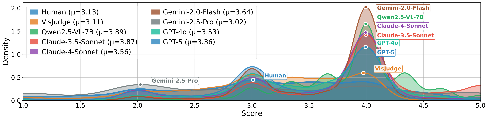
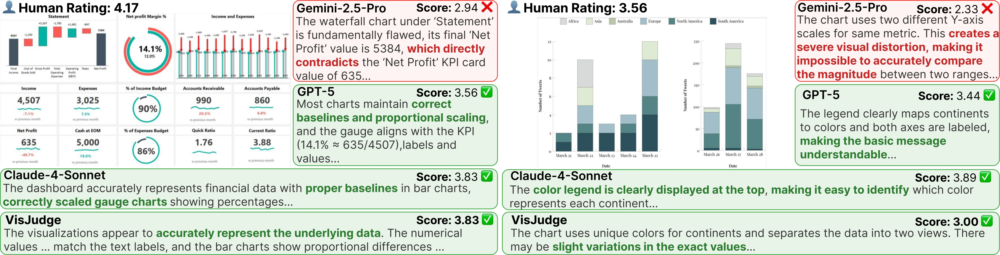

# 📊 VisJudgeBench

**VisJudgeBench: Aesthetics and Quality Assessment of Visualizations**

## 🎯 About VisJudgeBench

VisJudgeBench is a comprehensive benchmark dataset for visualization quality assessment based on the **"Fidelity-Expressiveness-Aesthetics"** evaluation framework. We release the complete dataset with **3,090 expert-annotated samples** across three categories (`single_vis`, `multi_vis`, `dashboard`), where each sample includes visualization images, six-dimensional quality scores, and evaluation prompts.

<div align="center">
  
  <p><em>Why we need specialized visualization assessment: MLLMs excel at general aesthetics but struggle with visualization-specific evaluation</em></p>
</div>

## 🔍 Evaluation Framework

Our benchmark evaluates visualizations across three fundamental dimensions, operationalized into six measurable metrics:

<div align="center">
  
  <p><em>The Fidelity-Expressiveness-Aesthetics evaluation framework with positive and negative examples</em></p>
</div>

**1. Fidelity - Data Accuracy and Truthfulness**

- `data_fidelity`: Evaluates whether visual encodings accurately reflect the original data, avoiding misleading interpretations caused by improper axis settings, scale distortions, or other design flaws.

**2. Expressiveness - Information Clarity and Understandability**

- `semantic_readability`: Assesses the clarity of basic information encoding and whether users can unambiguously decode visual elements.
- `insight_discovery`: Evaluates the effectiveness in revealing deep data patterns, trends, or outliers, helping users transition from "reading information" to "gaining insights".

**3. Aesthetics - Visual Aesthetics and Refinement**

- `design_style`: Measures the innovation and uniqueness of design, including novel visual elements and distinctive style.
- `visual_composition`: Focuses on the rationality of spatial layout, evaluating the balance and order of element positioning, size proportions, and spacing arrangements.
- `color_harmony`: Assesses the coordination and functionality of color combinations, ensuring color palette choices balance aesthetics with effective information communication.

## 🏗️ Benchmark Construction

Our benchmark follows a rigorous three-stage construction pipeline to ensure high-quality annotations:

<div align="center">
  
  <p><em>Three-stage benchmark construction: Data Collection → Evaluation Framework → Expert Annotation</em></p>
</div>

## 📁 Repository Structure

```
VisJudgeBench/
├── README.md                    # This file
├── VisJudgeBench.json          # Complete dataset with 3,090 annotated samples
├── figures/                    # Figures for documentation
└── images/                     # Visualization images organized by category
    ├── single_vis/             # Single visualization charts
    ├── multi_vis/              # Multi-panel visualizations
    └── dashboard/              # Dashboard-style visualizations
```

## 📈 Dataset Statistics

Our benchmark contains **3,090 expert-annotated samples** across three main categories and **32 distinct subtypes**:

| Category | Samples | Subtypes | All Subtypes (Count) |
|----------|---------|----------|---------------------|
| **Single Visualization** | 1,041 | 22 | Bar Chart (176) • Pie Chart (129) • Line Chart (100) • Area Chart (75) • Treemap (62) • Sankey Diagram (61) • Heatmap (55) • Scatter Plot (49) • Histogram (48) • Donut Chart (47) • Funnel Chart (45) • Bubble Chart (29) • Network Graph (28) • Word Cloud (27) • Waterfall Chart (24) • Box Plot (21) • Radar Chart (19) • Gauge Chart (16) • Sunburst Chart (14) • Violin Plot (12) • Parallel Coordinates (10) • Chord Diagram (9) |
| **Multiple Visualizations** | 1,024 | 5 | Comparison Views (670) • Small Multiples (195) • Coordinated Views (97) • Other Multi View (59) • Overview Detail (3) |
| **Dashboard** | 1,025 | 5 | Analytical Dashboard (743) • Operational Dashboard (122) • Interactive Dashboard (91) • Strategic Dashboard (62) • Other Dashboard (7) |
| **🎯 Total** | **3,090** | **32** | **Complete Coverage Across All Visualization Types** |

## 🏆 Benchmark Results

We systematically evaluate multiple state-of-the-art multimodal large language models (MLLMs) on VisJudgeBench to assess their visualization quality assessment capabilities.

### 🤖 Can MLLMs Assess Visualization Quality and Aesthetics Like Humans?

**Quick Overview - Model Rankings by Overall Performance:**

| Rank | Model | MAE (↓) | MSE (↓) | Correlation (↑) |
|------|-------|---------|---------|-----------------|
| 🥇 | **VisJudge** | **0.442** | **0.306** | **0.681** |
| 🥈 | GPT-5 | 0.551 | 0.484 | 0.429 |
| 🥉 | GPT-4o | 0.609 | 0.575 | 0.482 |
| 4 | Claude-4-Sonnet | 0.618 | 0.596 | 0.470 |
| 5 | Gemini-2.5-Pro | 0.661 | 0.674 | 0.266 |
| 6 | Gemini-2.0-Flash | 0.680 | 0.716 | 0.395 |
| 7 | Claude-3.5-Sonnet | 0.823 | 1.006 | 0.395 |
| 8 | Qwen2.5-VL-7B | 1.048 | 1.502 | 0.322 |

**Key Findings:**

- 🏗️ **Hierarchical Capability Structure**: Models perform relatively well on **Fidelity** dimensions, moderately on **Expressiveness** dimensions, but struggle significantly with **Aesthetics** dimensions (average MAE >0.7, correlations <0.4)

- 🤖 **Model-Specific Evaluation Characteristics**: Each model exhibits distinct "evaluation personalities":
  - **GPT-5**: Balanced performance with competitive overall accuracy
  - **GPT-4o**: Relative strength in Color Harmony assessment (MAE 0.657)
  - **Claude-4-Sonnet**: Excels in Semantic Readability evaluation (MAE 0.757)
  - **Gemini-2.0-Flash**: Leads in Data Fidelity assessment (MAE 0.828)

- 🎯 **Domain-Specific Fine-tuning Effectiveness**: VisJudge demonstrates substantial improvements:
  - **19.8% MAE reduction** over GPT-5 (from 0.551 to 0.442)
  - **41.3% correlation improvement** over GPT-4o (from 0.482 to 0.681)
  - **Superior performance across all core metrics** with overall correlation of 0.681

<details>
<summary><strong>📋 Click to view detailed performance breakdown by dimensions</strong></summary>

<div align="center">

<table>
<caption><strong>Comprehensive performance of MLLMs and VisJudge across all evaluation metrics and dimensions</strong></caption>
<thead>
<tr>
<th rowspan="2"><strong>Metric</strong></th>
<th rowspan="2"><strong>Model</strong></th>
<th rowspan="2"><strong>Overall</strong></th>
<th rowspan="2"><strong>Fidelity</strong></th>
<th colspan="2"><strong>Expressiveness</strong></th>
<th colspan="3"><strong>Aesthetics</strong></th>
</tr>
<tr>
<th><strong>Readability</strong></th>
<th><strong>Insight</strong></th>
<th><strong>Design Style</strong></th>
<th><strong>Composition</strong></th>
<th><strong>Color</strong></th>
</tr>
</thead>
<tbody>
<tr>
<td rowspan="8"><strong>MAE (↓)</strong></td>
<td>Claude-3.5-Sonnet</td>
<td>0.823</td>
<td>0.977</td>
<td>0.902</td>
<td>1.152</td>
<td>0.782</td>
<td>0.939</td>
<td>0.862</td>
</tr>
<tr>
<td>Claude-4-Sonnet</td>
<td>0.618</td>
<td>0.839</td>
<td>0.757</td>
<td>0.890</td>
<td>0.606</td>
<td>0.695</td>
<td>0.704</td>
</tr>
<tr>
<td>Gemini-2.0-Flash</td>
<td>0.680</td>
<td>0.828</td>
<td>0.920</td>
<td>1.065</td>
<td>0.640</td>
<td>0.777</td>
<td>0.797</td>
</tr>
<tr>
<td>Gemini-2.5-Pro</td>
<td>0.661</td>
<td>0.856</td>
<td>0.924</td>
<td>1.058</td>
<td>0.649</td>
<td>0.756</td>
<td>0.758</td>
</tr>
<tr>
<td>GPT-4o</td>
<td>0.609</td>
<td>0.859</td>
<td>0.840</td>
<td>0.966</td>
<td>0.636</td>
<td>0.699</td>
<td>0.657</td>
</tr>
<tr>
<td>GPT-5</td>
<td>0.551</td>
<td>0.839</td>
<td>0.839</td>
<td>0.839</td>
<td>0.575</td>
<td>0.655</td>
<td>0.671</td>
</tr>
<tr>
<td>Qwen2.5-VL-7B</td>
<td>1.048</td>
<td>1.129</td>
<td>1.243</td>
<td>1.454</td>
<td>1.039</td>
<td>1.192</td>
<td>1.097</td>
</tr>
<tr>
<td><strong>VisJudge</strong></td>
<td><strong>0.442</strong></td>
<td><strong>0.690</strong></td>
<td><strong>0.718</strong></td>
<td><strong>0.655</strong></td>
<td><strong>0.472</strong></td>
<td><strong>0.528</strong></td>
<td><strong>0.567</strong></td>
</tr>
<tr>
<td rowspan="8"><strong>MSE (↓)</strong></td>
<td>Claude-3.5-Sonnet</td>
<td>1.006</td>
<td>1.386</td>
<td>1.234</td>
<td>1.910</td>
<td>0.954</td>
<td>1.311</td>
<td>1.139</td>
</tr>
<tr>
<td>Claude-4-Sonnet</td>
<td>0.596</td>
<td>1.032</td>
<td>0.902</td>
<td>1.198</td>
<td>0.576</td>
<td>0.749</td>
<td>0.755</td>
</tr>
<tr>
<td>Gemini-2.0-Flash</td>
<td>0.716</td>
<td>1.007</td>
<td>1.310</td>
<td>1.606</td>
<td>0.632</td>
<td>0.948</td>
<td>0.991</td>
</tr>
<tr>
<td>Gemini-2.5-Pro</td>
<td>0.674</td>
<td>1.070</td>
<td>1.326</td>
<td>1.637</td>
<td>0.652</td>
<td>0.894</td>
<td>0.887</td>
</tr>
<tr>
<td>GPT-4o</td>
<td>0.575</td>
<td>1.064</td>
<td>1.082</td>
<td>1.329</td>
<td>0.622</td>
<td>0.743</td>
<td>0.653</td>
</tr>
<tr>
<td>GPT-5</td>
<td>0.484</td>
<td>1.043</td>
<td>1.053</td>
<td>1.053</td>
<td>0.517</td>
<td>0.675</td>
<td>0.710</td>
</tr>
<tr>
<td>Qwen2.5-VL-7B</td>
<td>1.502</td>
<td>1.765</td>
<td>2.091</td>
<td>2.784</td>
<td>1.486</td>
<td>1.965</td>
<td>1.646</td>
</tr>
<tr>
<td><strong>VisJudge</strong></td>
<td><strong>0.306</strong></td>
<td><strong>0.720</strong></td>
<td><strong>0.836</strong></td>
<td><strong>0.678</strong></td>
<td><strong>0.350</strong></td>
<td><strong>0.421</strong></td>
<td><strong>0.508</strong></td>
</tr>
<tr>
<td rowspan="8"><strong>Correlation (↑)</strong></td>
<td>Claude-3.5-Sonnet</td>
<td>0.395</td>
<td>0.470</td>
<td>0.373</td>
<td>0.292</td>
<td>0.377</td>
<td>0.398</td>
<td>0.291</td>
</tr>
<tr>
<td>Claude-4-Sonnet</td>
<td>0.470</td>
<td>0.603</td>
<td>0.484</td>
<td>0.386</td>
<td>0.407</td>
<td>0.405</td>
<td>0.375</td>
</tr>
<tr>
<td>Gemini-2.0-Flash</td>
<td>0.395</td>
<td>0.612</td>
<td>0.311</td>
<td>0.225</td>
<td>0.380</td>
<td>0.396</td>
<td>0.311</td>
</tr>
<tr>
<td>Gemini-2.5-Pro</td>
<td>0.266</td>
<td>0.554</td>
<td>0.207</td>
<td>0.075</td>
<td>0.242</td>
<td>0.272</td>
<td>0.187</td>
</tr>
<tr>
<td>GPT-4o</td>
<td>0.482</td>
<td>0.598</td>
<td>0.419</td>
<td>0.338</td>
<td>0.418</td>
<td>0.442</td>
<td>0.407</td>
</tr>
<tr>
<td>GPT-5</td>
<td>0.429</td>
<td>0.598</td>
<td>0.398</td>
<td>0.397</td>
<td>0.352</td>
<td>0.400</td>
<td>0.357</td>
</tr>
<tr>
<td>Qwen2.5-VL-7B</td>
<td>0.322</td>
<td>0.421</td>
<td>0.255</td>
<td>0.106</td>
<td>0.280</td>
<td>0.334</td>
<td>0.220</td>
</tr>
<tr>
<td><strong>VisJudge</strong></td>
<td><strong>0.681</strong></td>
<td><strong>0.667</strong></td>
<td><strong>0.579</strong></td>
<td><strong>0.567</strong></td>
<td><strong>0.512</strong></td>
<td><strong>0.385</strong></td>
<td><strong>0.496</strong></td>
</tr>
</tbody>
</table>

</div>

</details>

### 📊 Do MLLMs Exhibit Human-like Scoring Behaviors?

<div align="center">
  
  <p><em>Rating patterns of different models compared to human experts (μ<sub>human</sub>=3.13)</em></p>
</div>

**Systematic Biases Revealed:**

- **Score Inflation**: Most models (Qwen2.5-VL-7B μ=3.89, Claude-3.5-Sonnet μ=3.87) tend to over-rate visualizations
- **Overly Conservative**: Gemini-2.5-Pro (μ=3.02) tends to under-rate visualizations
- **Perfect Alignment**: VisJudge (μ=3.11) achieves near-perfect alignment with human rating distribution (μ=3.13)

### 📈 How Does Visualization Complexity Affect Model Performance?

<div align="center">
  
  <p><em>Model-human rating correlation across different visualization types and evaluation dimensions</em></p>
</div>

**Key Insights:**

- All models show **performance degradation** as complexity increases: Single Vis > Multi Vis > Dashboard
- VisJudge maintains the **best performance** across all types: 0.577 (Single), 0.565 (Multi), 0.375 (Dashboard)
- **Aesthetic dimensions** (especially Visual Composition) are most challenging in complex dashboards

### 🔍 How Do Model Evaluation Behaviors Differ in Practice?

Our case studies reveal two common biases in model evaluation behaviors: **score inflation** and **overly conservative** assessments.

<div align="center">
  
  <p><em>Model evaluation examples on low-quality visualizations showing score inflation bias</em></p>
</div>

**Score Inflation:** For a chaotic treemap (human rating: 1.67), baseline models give inflated scores. For instance, Qwen2.5-VL-7B (3.67) praises its "clear legend" while ignoring the confusing layout, and Claude-4-Sonnet (3.08) incorrectly highlights "excellent spatial organization". In contrast, VisJudge's score of 2.00 aligns with human judgment, correctly identifying the "chaotic layout" that impairs interpretation.

<div align="center">
  
  <p><em>Case study highlighting the conservative bias of Gemini-2.5-Pro</em></p>
</div>

**Overly Conservative:** Conversely, Gemini-2.5-Pro exhibits overly conservative bias. For a high-quality dashboard rated 4.17 by humans, Gemini-2.5-Pro gives a disproportionately low score of 2.94, focusing on a single data inconsistency while overlooking the chart's overall effectiveness. Similarly, for another chart (human rating: 3.56), it scores only 2.33 due to the use of dual Y-axes. VisJudge demonstrates more balanced evaluations (3.83 and 3.00, respectively).

## 📋 Data Format

The dataset is stored in JSON format (`VisJudgeBench.json`), where each entry contains the following fields:

- **`_id`**: Unique identifier for each sample
- **`type`**: Visualization category (`single_vis`, `multi_vis`, or `dashboard`)
- **`subtype`**: Specific subcategory within the main type
- **`image_path`**: Path to the corresponding visualization image
- **`overall_score`**: Overall quality score (average of six dimension scores, ranging from 1.0 to 5.0)
- **`dimension_scores`**: Six-dimensional quality assessment scores (see Evaluation Framework above for detailed descriptions of each dimension)
- **`prompt`**: Complete evaluation prompt with detailed scoring criteria for each dimension

### 💡 Example Entry

```json
{
  "_id": "0001_single_graph",
  "type": "single_vis",
  "subtype": "bar",
  "image_path": "images/0001_single_graph.png",
  "overall_score": 3.83,
  "dimension_scores": {
    "data_fidelity": 4.00,
    "semantic_readability": 4.00,
    "insight_discovery": 4.00,
    "design_style": 3.00,
    "visual_composition": 4.33,
    "color_harmony": 3.67
  },
  "prompt": "[Detailed evaluation prompt with scoring criteria]"
}
```

---

## 🚀 Getting Started

### Prerequisites

```bash
pip install openai anthropic google-generativeai qwen_vl_utils
```

### Running Evaluations

```python
# Basic example using GPT-4o
import json
from openai import OpenAI

client = OpenAI(api_key="your-api-key")

# Load dataset
with open('VisJudgeBench.json', 'r') as f:
    dataset = json.load(f)

# Evaluate single image
sample = dataset[0]
response = client.chat.completions.create(
    model="gpt-4o",
    messages=[
        {"role": "user", "content": [
            {"type": "image_url", "image_url": {"url": sample['image_path']}},
            {"type": "text", "text": sample['prompt']}
        ]}
    ]
)

print(response.choices[0].message.content)
```

---

## 📖 Citation

If you find VisJudgeBench useful for your research, please cite our paper:

```bibtex
@article{visjudgebench2025,
  title={VisJudgeBench: A Benchmark for Evaluating Visualization Quality Assessment Capabilities of Multimodal Large Language Models},
  author={[Authors]},
  journal={arXiv preprint},
  year={2025}
}
```

---

## 📄 License

This project is licensed under the MIT License - see the [LICENSE](LICENSE) file for details.

---

## 🤝 Contributing

We welcome contributions! Please feel free to submit a Pull Request.

---

## 📧 Contact

For questions or collaborations, please contact: [your-email@example.com]

---

<div align="center">
  <strong>VisJudgeBench</strong> - Advancing Visualization Quality Assessment with Multimodal AI
</div>

---

For questions or feedback, please contact: yxie740@connect.hkust-gz.edu.cn
